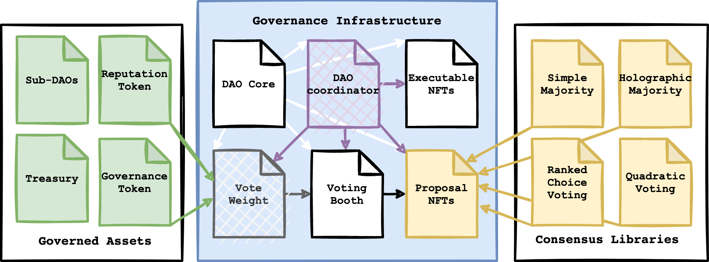

# Atlantis Lightpaper V1.5
###### Upgradeable, extendable, compostable

# Index
// TODO

# 1. Abstract

Existing DAO frameworks are static, non-composable and siloed. Often the frameworks disable modifications, or require changes to go through their meta-DAO. These siloed frameworks make cross-DAO collaboration difficult. Being static, redeployment of the entire DAO is required for functionality changes. 

Optimised to reduce deployment costs on L1, the existing frameworks infrastructure are monolithic and aggregated. This inherently makes the smart contract systems highly complex, requiring convoluted and risky low level design patterns to upgrade. Additionally, DAO assets (such as governance tokens, treasury etc) are directly integrated into the framework, making the migration of DAOs assets near impossible. 

These challenges result in teams forking the framework to make their own customisations, or resorting to off-chain coordination mechanisms rather than codifying decisions on-chain. At Atlantis, we believe this fundamentally goes against the compostable nature of decentralisation and is in direct opposition to what projects need for effective, evolvable governance. 

# 2. Introducing Atlantis 

#### TLDR; 
**Atlantis enables a flexible DAO framework through the separation of governance functionality from governed assets.** This modularised design means you never need to re-deploy your DAO to change how governance works. The combination of a highly evolvable framework with an emphasis on composability puts the control of the DAO back in the hands of its members, instead of being actively limited by the framework.

The modular design enables DAOs that are highly upgradeable, extendable, compostable and more secure. Atlantis DAOs can easily cooperate and coordinate with external DAOs, irrespective of the external DAOs framework. Atlantis DAOs can also easily create customised sub-DAOs, from temporary working groups, to sub-DAOs that can evolve into a standalone DAO later. 

Governance functionality is unopinionated, evolvable and intuitive. Out the box these modules handle the essential functionality of on-chain governance, like proposals, voting and on-chain execution. The modules are easily modifiable and replaceable, enabling a truly evolvable DAO.

Governed assets do not have to conform to an interface, implementation design or standard, allowing for an Atlantis DAO to manage any asset. This design separation also means that a DAO can easily move its governed assets without the need for a complex migration process. 

# 3. Atlantis Framework 101 

    

There are three major parts to the Atlantis framework: Governance infrastructure, governed assets and external libraries. Between these three parts, lay an infinite array of DAO configurations. 

### 3.1.1 Governance Infrastructure 
The Governance Infrastructure (blue center square) contains all the functionality needed to run a DAO. The transparent contracts are pure infrastructure, meaning your users will never directly interact with them. In this most basic DAO there are only 3 contracts that DAO members will need to interact with: 

* Executable NFTs
Enables the creation of complex (or simple!) transitions onchain. The executables can easily be simulated and verified, allowing for trustless execution. As the executable NFTs can call any arbitrary functions, there is no standard or interface governed assets need to follow.
Proposal NFTs
Facilitates DAO members to create proposals, using any of the consensus mechanisms registered with the DAO. Proposals can have executable NFTs specified, allowing for onchain transactions to be executed in the context of the DAO. 
Voting Booth
Enables members to vote on existing proposals. Once the voting period is over, anyone can call “execute” on the DAO and the DAO coordinator will ensure that the vote passed according to the specified consensus mechanisms.

### 3.1.2 Governed Assets
Governed assets are completely separate from the governance functionality, greatly increasing security by reducing the access of assets from governance in accordance with the principle of least privilege. Governed assets can be any smart contract, token asset, or general on-chain asset. Atlantis DAOs can manage this incredibly wide array of asset types through executable NFTs.

The proposal NFTs and executable NFTs will share the same base modified ERC721 contract. These NFTs have a type, which allows us to distinguish between proposals and execution. An EIP for this standard is underway. 

### 3.1.3 External Libraries
External Libraries are used to externalise functionality that is likely to change or upgrade often. This enables quick and frictionless functionality upgrades, extensions and additions without needing to modify your DAO. 

In the initial Atlantis framework, externalised libraries are used for consensus mechanisms. These externalised libraries mean that the voting booth does not need to understand or manage when or how a vote passes, enabling flexible proposals that can specify which consensus mechanism to use.

For example, many DAOs use the idea of “boosted” proposals, where a member signals the importance of a proposal. This boost takes a proposal from a simple majority to a holographic majority consensus mechanism. With the externalised consensus mechanism the proposal can simply point to the new consensus mechanism. The idea of externalized libraries can later be extended to multiple modules within the Atlantis framework.

## 3.2 Example DAO
This example is in no way a comprehensive run-through of all the functionality unlocked with the Atlantis framework but serves as an eye-opener for the possibilities. We will go through the three (oversimplified) steps they need to take to evolve an Atlantis DAO from centralised to decentralised. 

### 3.2.1 Multisig controlled CAO
Before we can decentralise our DAO, we need a centralised DAO (or a CAO for clarity). Below we can see what that would look like within the Atlantis framework. 

A modified “Vote Weight” module accommodates a centralised voting scheme. Allowing the multisig to create and vote on proposals. The consensus library is also modified to be centralised. Only actions from the multisig are valid in this stage, and all other votes, proposals, and executables will be rejected. 

### 3.2.2 Hybrid DAO 
As the DAO evolves from centralised to a more open governance setup, they will not need to re-deploy their DAO. Instead, through the Atlantis framework, they can swap out core modules through the governance process (an executable and linked proposal). This proposal will open up the CAO into a hybrid setup. 

The “Signal Hybrid” consensus mechanism allows for governance token holders to vote on proposals. However, at the end of the voting phase, the multisig still has the final say on any specific proposal. This is managed by the “Hybrid Vote Weight”.

It is important for this upgrade to happen in a single transaction to prevent the DAO from being broken in a partially updated state. This can easily be accommodated through the executable NFTs. The upgrade executable can also be extensively simulated to ensure the end state of the DAO is correct.  

The Atlantis framework can accommodate any variation of any module. To transition between “states” we will need to execute upgrades on the governance infrastructure contracts. We will cover the exact steps needed for this in the transition proposal section. 

### 3.2.3 Decentralised DAO
The community is now ready to move to a decentralised setup. The DAO will need to replace the coordinator and vote weight contracts again. The multisig will lose its elevated permissions on the vote weight, meaning the multisigs vote weight will be calculated the same way as other voters, through its governance token holdings. 

### 3.2.4 Transition proposals
To fully understand how a transition between DAO governance states we are going to take the example above and create all the required pieces (a proposal and executable) to actually execute the transition. 

Below is a walk through of the process that would go into creating this executable:

1. Deploy the new contracts: CAO coordinator and hybrid vote weight.
2. Create an executable NFT to replace the old coordinator with the new one. This would entail:
3. Updating the voting booth, executable NFT, and proposal contract to point to the new coordinator instance. This is three calls.
4. Making the freshly deployed hybrid vote weight point to the new coordinator instance. One call.
5. The old vote weight would simply be discarded. No calls needed.
6. Register the new consensus mechanism with the coordinator. One call.
7. Create a proposal to run the created executable.

The created executable would consist of five transactions as laid out above. The order of the transactions is important, and for any upgrading executables it is highly recommended to thoroughly simulate the executable. 

After creation of the proposal, the multisig can vote to pass it. Then the multisig would call the execute proposal function on the core contract, which would then execute all the transactions we built in the executable in the context of the deployed DAO. As this runs atomically (the whole upgrade proposal either runs successfully or fails and nothing changes) the DAO has no down time. 

# 3.3 Inter-DAO Collaboration
The Atlantis framework enables DAO to DAO coordination and nested DAOs in ways that most frameworks could only dream of accommodating. Below we will go over a run-through of how the framework enables DAO coordination, nested DAOs and how this is only the beginning of DAO cooperation. 
The diagrams show how you can use Atlantis for DAO to DAO (D2D) coordination. Atlantis can cover a wide range of inter-DAO relationships, from once off collaborations to long term commitments. Note that a lot is going on in these diagrams, so don’t worry if you don’t get it at first glance!
External DAO coordination
Here we are going to talk specifically about coordination between completely separate DAOs. The external DAO does not need to be an Atlantis DAO to collaborate, further demonstrating how Atlantis is an anti-silo framework.

In this example, the external DAO is not an Atlantis DAO, and as such needs the “D2D Adapter: Collaboration” which will correctly format the external DAO’s governance weighting. If the external DAO was an Atlantis DAO their Vote Weight would directly plug into the D2D Vote Weight. 
The new D2D vote weight means that when addresses vote on the proposal, the D2D vote weight will check against the internal vote weight as well as the adapter for the DAO member’s inter-DAO vote weight.So let's put some numbers to this to make sense of it all. 
Alice has 100 governance tokens on this DAO. Normally this means her vote weight is 100 on proposals. On the collaboration proposal (the one using the D2D vote weight) her vote weight will take into account her weight on both DAOs. Alice is not a member of the external DAO, so her vote weight there is 0. The D2D vote weight will then balance these weights using the following calculation: 
(DAO 1 vote weight + DAO 2 vote weight) / 2 = D2D vote weight
This would give Alice a vote weight of (100+0)/2 = 50. Note that this is a simple weighting calculation for this example.
Sub-DAO Nesting
The Atlantis framework accommodates sub-DAOs with varying levels of independence. The independence of the sub-DAO is determined by their D2D adapter. 
The sub-DAO, like everything within the Atlantis framework, can be upgraded and modified as it evolves, allowing the sub-DAO to start dependent on its parent DAO and slowly evolve into an independent DAO. The beauty of the Atlantis framework!

You will notice this pattern is very similar to the external DAO integration. This allows for sub-DAOs to have a flexible level of autonomy, and easily spin off to an independent DAO with relatively little changes.
Just like with the external DAO collaboration, a D2D Vote Weight is used. The D2D Vote Weight will determine the weight of voters in the sub-DAO. As the sub-DAO is also an Atlantis DAO there is no need for an adapter. For a non-Atlantis sub-DAO a “D2D Adapter: Parent to Child” would need to be custom built to integrate with the DAOs framework, and probably require a fork of the desired framework. 
Sub-DAOs can also have their own governance and reputation token. A governance token in a sub-DAO allows for a higher degree of independence, as the sub-DAO can start accruing independent value. A reputation token works much better in the case of organisational sub-DAOs i.e a marketing sub-DAO. Reputation allows users who are more engaged in the sub-DAO to have a higher vote weight than those who are just generally involved in the parent DAO. 

Summary
The Atlantis DAO framework enables highly flexible and non-siloed DAO cooperation. The modular and upgradeable design allows for endless customisation. Atlantis believes in a DAO future, where companies, organisations and collectives can be built around collaboration, reward contribution and maintain an engaged workforce. 
The Atlantis framework is built under the umbrella of a public good. All development is happening under the MIT licence.
Next Steps
The Atlantis framework is in the early stages of development. Please support our GitCoin Grant if you’d like to support the project. Every little bit helps!
If you’d like to get in as a beta user to set up an Atlantis DAO for your organisation, upgrade an existing DAO or play around with the contracts, feel free to contact us at:
hello@AtlantisDAO.xyz
Follow @DaoAtlantis on Twitter to follow our progress. If you’d like to contact us directly, you can DM @vonnie610 on Twitter and Telegram. 
Feel free to reach out to us if you have feedback or questions! 

